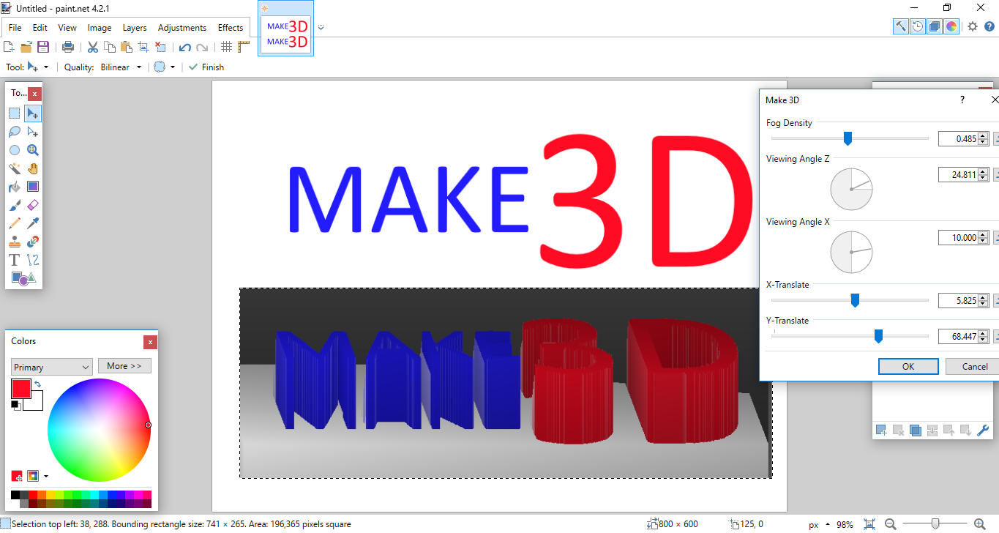
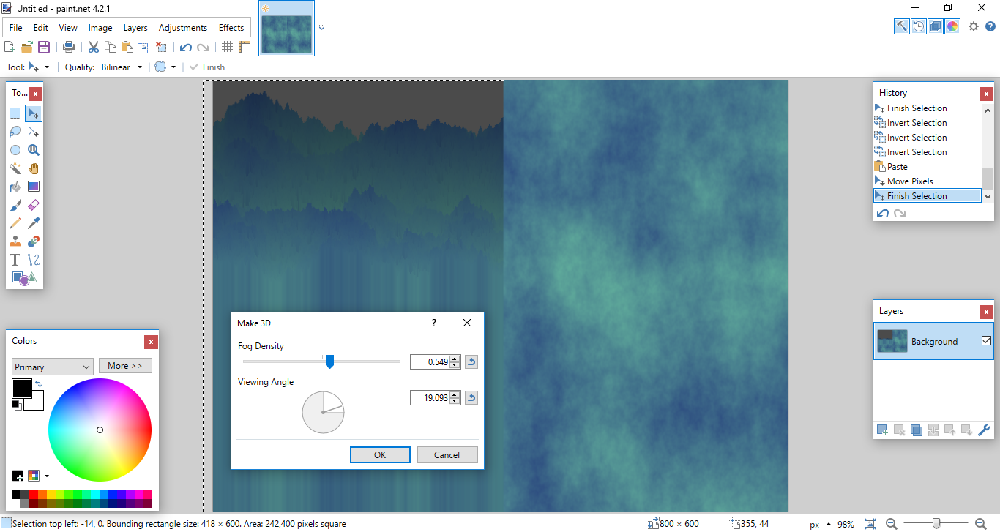

# Make 3D
Projects a 2D image into 3D based on the intensity of the colors in the image. Mostly built as a test of my own matrix algebra memory, but it works pretty well. It's basically a simple raycasting tool. The user can define the angle the viewer is looking at the projection of the image from for X and Z rotations, and how much fog distance should add.

NOTE: Only works up to certain angles, otherwise 3D objects start getting cut off. Not sure what causes this...

## TODO
* I'd like to make this have an FOV so objects in the distance converge, but I'm not sure how to go about that yet. Maybe a project for another time...
* Figure out how to remove the bug where objects get cut off if they're too far back
