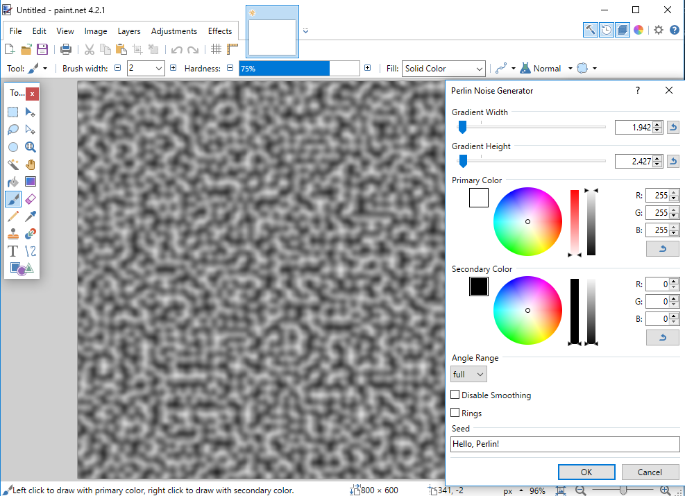
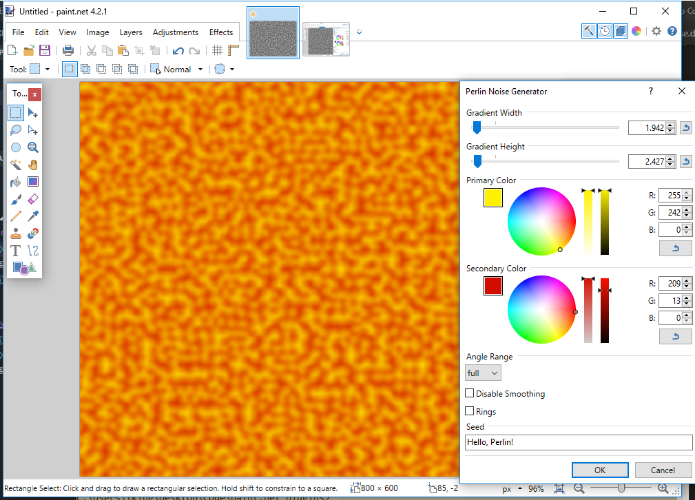
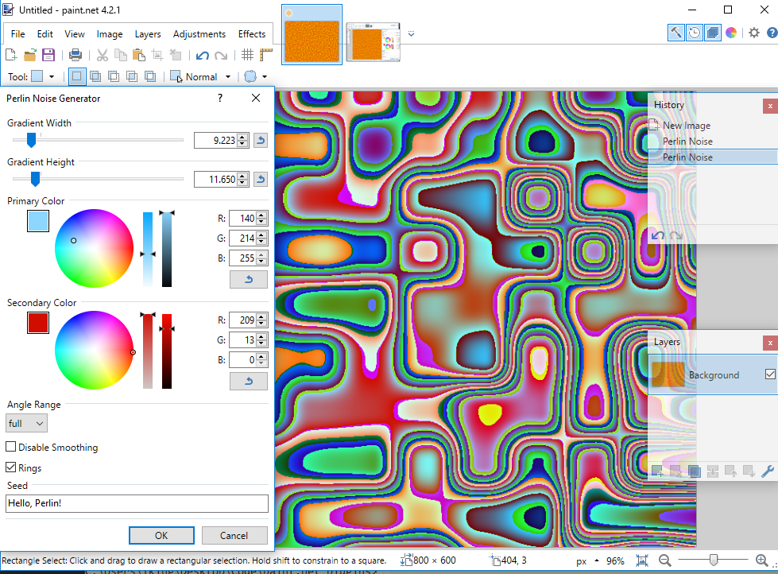

# Perlin Noise Generator
Just generates Perlin noise given user specifications. I couldn't help but notice that there are many PDN plugins that *utilize* Perlin noise, but none so far as I could tell, that generate it. Well, that's what this does. It's not glamorous, but it's necessary for lots of other cool stuff, so here you go.

You can specify the size, and allowed angles of the underyling gradient that determines pixel color, as well as the color of the noise (default is black and white).

Additionally, I turned an old bug that made the underlying gradient field visible into a feature. Select "rings" if you want to see the gradient lines that are doing the math behind the noise!

*Normal output*

*Colored output*

*It's not a bug; it's a feature!*
