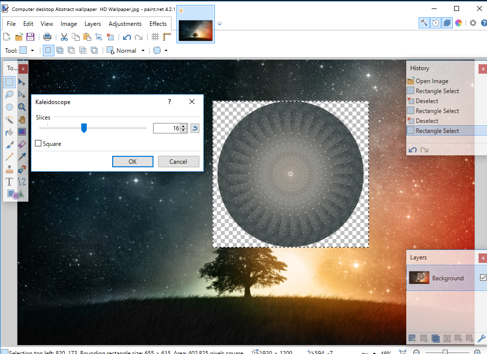

# Kaleidoscope
As of right now, this tool will make a mandala-like radial symmetry pattern from any selection based on the largest possible radius that can fit into that selection. It works surprisingly well (if a little slow)

User can select between 2 and 180 slices per half of the circle (4-360) and may adjust the angle that the slices repeat using the angle slider. 

