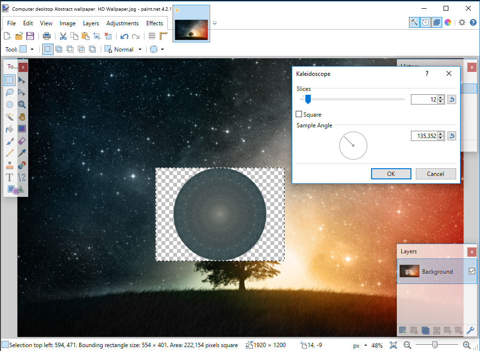

# Kaleidoscope
As of right now, this tool will make a mandala-like radial symmetry pattern from any selection based on the largest possible radius that can fit into that selection. It works surprisingly well (if a little slow)

In the future, I will add an option to change the section of the circle being used as the reference, but for right now, it is always the arc between 90 degrees plus the angle input by the user. 

