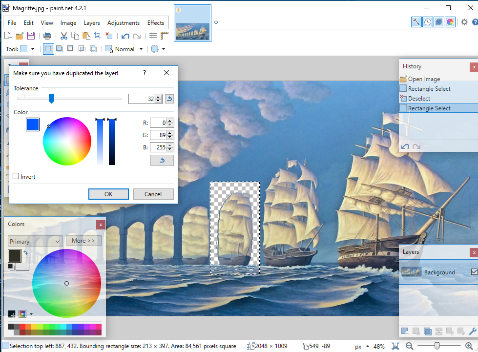

# Select Selection Colorrange
I started this tool hoping to make a select color range-like tool that only applied in already selected areas. Unfortunately, it isn't possible to change the user's selection from the Effects interface.

However, if you still want to use the tool for this purpose, simply copy the selected portion to a new layer, use the effect, and then use select layer (ctrl+click on the layer icon) to get the required selection. It kinda works...

