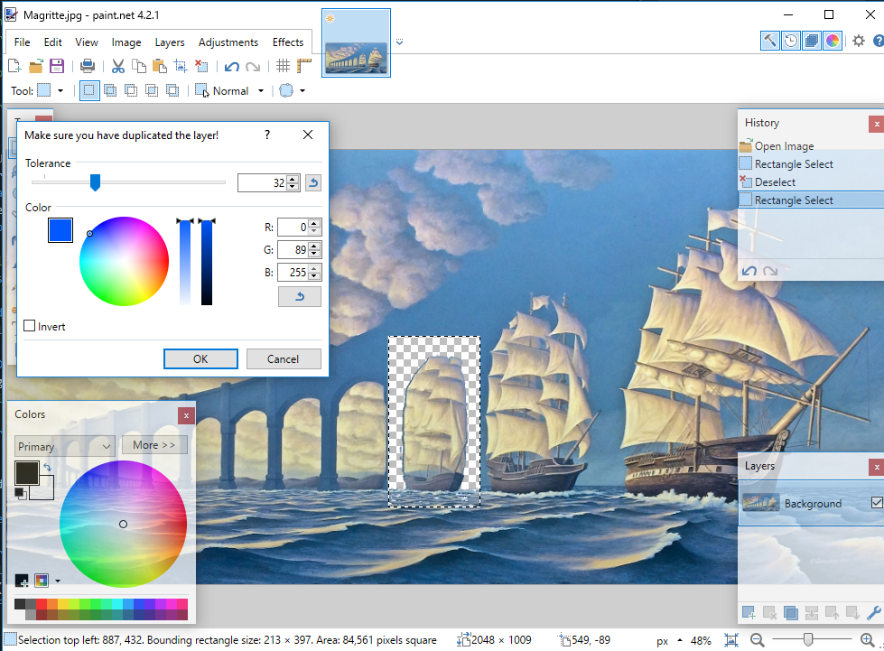

# Paint.NET-Plugins
Plugins I have made for use in Paint.NET

## Directory

### [Kaleidoscope](Kaleidoscope)
Turns a selected area into a mandala-like radial symmetry pattern based on the largest possible radius that can fit into that selection. User can select between 2 and 180 slices per half of the circle (4-360) and may adjust the angle that the slices repeat using the angle slider. 

### [Perlin Noise Generator](Perlin%20Noise)
Just generates Perlin noise given user specifications. I couldn't help but notice that there are many PDN plugins that *utilize* Perlin noise, but none so far as I could tell, that generate it. Well, that's what this does. Additionally, I added a few cool features to color the noise that generate maps, the pattern on composition notebooks and other stuff

### [Select Color Range](SelectColorRange)
Similar to the Photoshop select color range tool. My first real PDN plugin. Better tools that do the same thing exist, but this one is mine.

### [CodeLab Tutorial](Codelab-Tutorial)
While working through the [CodeLab tutorial](https://boltbait.com/pdn/codelab/) by BitBot, I placed example plugins in the Codelab-Tutorial folder. Nothing interesting to see here
